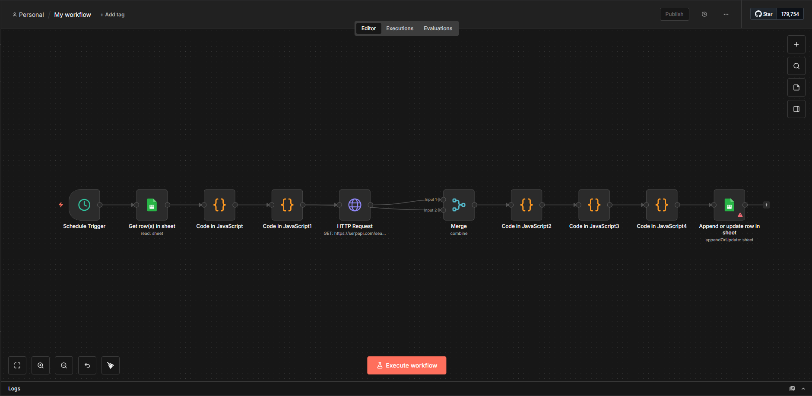

### Cybersecurity Job Tracking Automation System

An automated workflow that discovers, filters, and ranks cybersecurity job opportunities using API integration, workflow automation, and rule-based analysis.

---

##  Overview

**Cyber Job Radar** is a workflow-driven system built with **n8n** that automates the process of finding entry-level cybersecurity roles such as:

* SOC Analyst
* Security Analyst
* Incident Response
* SIEM / Threat Hunting

The system aggregates job listings from multiple platforms and intelligently filters and prioritises relevant opportunities — especially useful for international students seeking roles without citizenship restrictions.

---

##  Tech Stack

* **n8n** – Workflow Automation
* **JavaScript** – Custom logic (Code nodes)
* **SerpAPI** – Google Search integration
* **Google Sheets API** – Data storage & tracking
* **REST APIs** – Data ingestion
* **OAuth2** – Secure authentication

---

##  Key Features

*  **Automated Job Aggregation**
  Collects cybersecurity job listings from platforms like SEEK, Indeed, LinkedIn, and Glassdoor

*  **Smart Filtering Engine**
  Automatically removes roles requiring:

  * Australian citizenship
  * Security clearance (NV1/NV2/AGSVA)

*  **Visa-Friendly Detection**
  Identifies and boosts roles with:

  * Visa sponsorship
  * 485 eligibility
  * “Open to sponsorship” indicators

*  **Scoring & Ranking System**
  Assigns scores to jobs based on relevance and accessibility

*  **Automated Job Tracking**
  Stores structured results in Google Sheets for easy tracking and follow-up

---

##  Workflow Architecture

```
Google Sheets (Config: Keywords, Locations)
        ↓
Query Generator (n8n Code Node)
        ↓
SerpAPI (Google Search)
        ↓
Data Extraction (Normalize Results)
        ↓
Filtering Engine (Block/Boost Logic)
        ↓
Scoring System
        ↓
Google Sheets (Job Tracker)
```

---

##  Workflow Snapshot



---

##  Filtering Logic

###  Blocked Keywords

* australian citizen
* citizenship required
* NV1 / NV2 clearance
* AGSVA
* security clearance required

###  Boosted Keywords

* visa sponsorship
* sponsorship available
* 485 visa
* open to sponsorship

---

##  Use Case

Designed for:

* Cybersecurity graduates
* International students
* Entry-level job seekers

This system reduces manual effort and increases efficiency in discovering relevant cybersecurity opportunities.

---

##  Project Structure

```
cyber-job-radar/
│
├── README.md
├── workflow/
│   └── n8n-workflow.json
├── assets/
│   └── workflow-screenshot.png
├── config/
│   └── keywords-sample.csv
└── docs/
    └── architecture.md
```

---

##  Future Improvements

*  Email / Telegram job alerts
*  AI-based job relevance scoring
*  Dashboard visualization (Power BI / Grafana)
*  Duplicate job detection using URL hashing

---

##  Author

**Shino Shamit**
Cybersecurity Graduate | Automation & Security Enthusiast

---
